# 🧪 Zookeeper & Curator Case Study: Dining Philosophers

*A distributed implementation of dining philosophers problem to test Zookeeper coordination and Curator recipes*

## 🎯 Objectives

Test zookeeper with Curator client to assess the implementation of the following features:
1. Distributed Mutex and Semaphore
2. Watcher
3. Distributed queues
4. Leader Election
5. Service discovery

## 🏗️ Architecture Overview



```mermaid
architecture-beta
   group zookeeper[Zookeeper]
      service  zk1(server)[Zookeeper 1] in zookeeper
      service  zk2(server)[Zookeeper 2] in zookeeper
      service  zk3(server)[Zookeeper 3] in zookeeper

   service dp(logos:java)[Dining philosophers 1 to n services]
   service lb(logos:gopher)[Traefik]
   service prom(logos:prometheus)[Prometheus]
   service grafana(logos:grafana)[Grafana]

   zk1:T -- B:zk2
   zk2:R -- L:zk3
   zk1:R -- L:zk3
   lb:R -- L:zk2{group}
   lb{group}:B -- T:dp
   dp:R -- L:zk1{group}
   prom:R -- L:grafana
   dp{group}:B -- T:prom
```

## 🚀 Quick Start

```bash
git clone https://github.com/dboissin/zookeeper-curator-tests.git
cd zookeeper-curator-tests
docker-compose up -d --build
```

## 📈 Scaling

```bash
docker-compose up -d --build
```

## ⚙️ Core Stack
| Component   | Version | Purpose                          |
|-------------|---------|----------------------------------|
| Zookeeper   | 3.9.3   | Distributed coordination         |
| Curator     | 5.5.0   | Zookeeper client framework       |
| Java        | 21     | Implementation language          |
| Traefik | 3.4.0   | Load Balancer       |


## 🗄️ Project Structure

```
zookeeper-curator-tests
├── docker-compose.yml
├── Dockerfile
├── grafana
│   └── Dining_philosophers.json
├── pom.xml
├── prometheus.yml
├── README.md
└── src
    ├── main
    │   ├── java
    │   │   └── dev
    │   │       └── boissin
    │   │           ├── App.java
    │   │           ├── controller
    │   │           │   ├── EventsHandler.java
    │   │           │   ├── MetricsHandler.java
    │   │           │   ├── ReadinessHandler.java
    │   │           │   ├── SimpleHttpServer.java
    │   │           │   └── ViewHandler.java
    │   │           ├── exception
    │   │           │   ├── IllegalConcurrentForkUsageException.java
    │   │           │   └── InvalidStatusCodeException.java
    │   │           ├── model
    │   │           │   ├── Event.java
    │   │           │   └── StateEventCheckerResult.java
    │   │           ├── queue
    │   │           │   └── DiningPhilosophersQueue.java
    │   │           ├── serializer
    │   │           │   ├── RecordSerializationException.java
    │   │           │   └── RecordSerializer.java
    │   │           ├── service
    │   │           │   ├── Philosopher.java
    │   │           │   ├── PhilosopherManager.java
    │   │           │   └── StateEventsChecker.java
    │   │           └── util
    │   │               └── WorkerContext.java
    │   └── resources
    │       ├── assets
    │       │   └── view.html
    │       └── logback.xml
    └── test
        └── java
            └── dev
                └── boissin
                    └── src
                        └── test
                            └── resources

23 directories, 25 files
```

## 📜 License & Attribution

Copyright (C) 2025 Damien BOISSIN

This program is free software: you can redistribute it and/or modify
it under the terms of the GNU Affero General Public License as published
by the Free Software Foundation, either version 3 of the License, or
(at your option) any later version.

This program is distributed in the hope that it will be useful,
but WITHOUT ANY WARRANTY; without even the implied warranty of
MERCHANTABILITY or FITNESS FOR A PARTICULAR PURPOSE. See the
GNU Affero General Public License for more details.

You should have received a copy of the GNU Affero General Public License
along with this program. If not, see https://www.gnu.org/licenses/.
